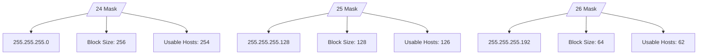
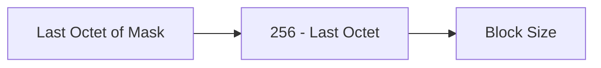
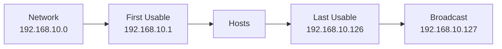
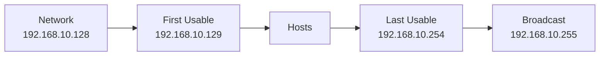
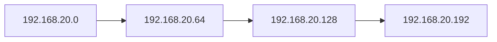
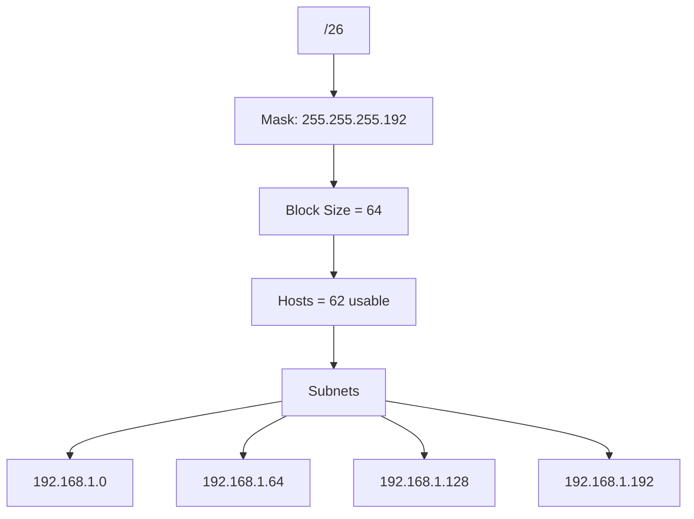
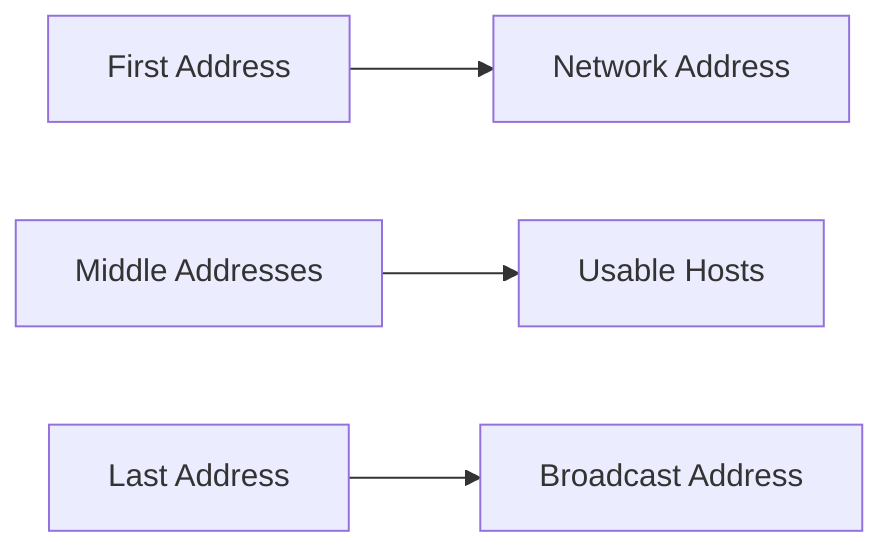
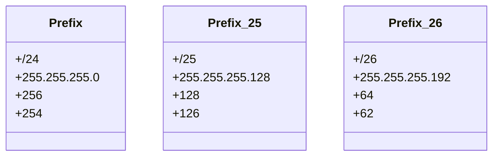

# Day 2 — Tuesday (1 Hour)

# Topic
Subnet Masks: `/24`, `/25`, `/26`

---

# Visual Overview



---

# How to Calculate Block Size



Example:

```text
/25 → 256 - 128 = 128
/26 → 256 - 192 = 64
```

---

# Exercise 1 — 192.168.10.0/25



---

# Exercise 2 — 192.168.10.128/25



---

# Exercise 3 — /26 Subnets



---

# Why /26 Uses 64



---

# Address Types Inside a Subnet



---

# Quick Memory Chart


