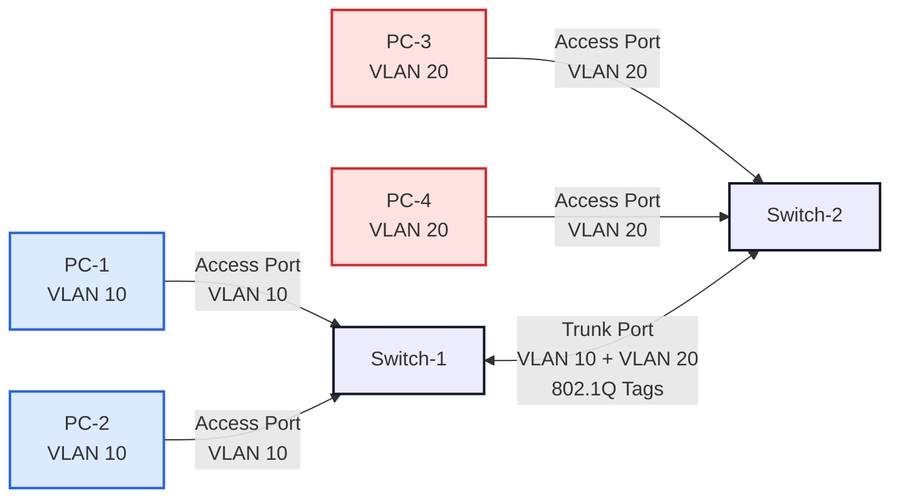

```mermaid
flowchart LR

PC1[PC-1\nVLAN 10]
PC2[PC-2\nVLAN 10]

PC3[PC-3\nVLAN 20]
PC4[PC-4\nVLAN 20]

SW1[Switch-1]
SW2[Switch-2]

PC1 -->|Access Port\nVLAN 10| SW1
PC2 -->|Access Port\nVLAN 10| SW1

PC3 -->|Access Port\nVLAN 20| SW2
PC4 -->|Access Port\nVLAN 20| SW2

SW1 <-->|Trunk Port\nVLAN 10 + VLAN 20\n802.1Q Tags| SW2


classDef vlan10 fill:#dbeafe,stroke:#2563eb,stroke-width:2px;
classDef vlan20 fill:#fee2e2,stroke:#dc2626,stroke-width:2px;
classDef switch fi1ll:#f3f4f6,stroke:#111827,stroke-width:2px;

class PC1,PC2 vlan10;
class PC3,PC4 vlan20;
class SW1,SW2 switch;
```