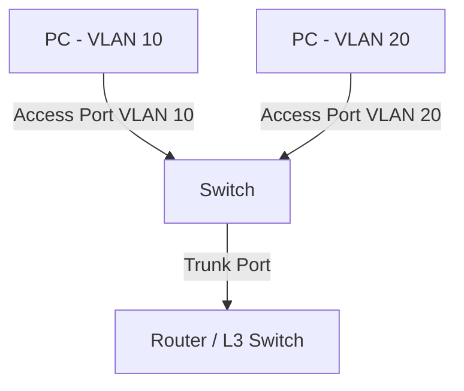

## VLAN Basics
### What is a VLAN?
A **VLAN (Virtual Local Area Network)** is a logical separation of devices within the same physical switch network.
Instead of every device being in one large broadcast domain, VLANs divide the network into smaller isolated groups.
Example:
- VLAN 10 → Sales
- VLAN 20 → HR
- VLAN 30 → IT1
Even if devices are connected to the same switch, VLANs keep their traffic separated.
## Why VLANs Are Useful
VLANs help with:
- **Security** → departments are isolated
- **Performance** → smaller broadcast domains reduce unnecessary traffic
- **Organization** → easier network management
- **Flexibility** → users can move without redesigning the network

## Access vs Trunk Ports

| Feature | Access Port | Trunk Port |
|---|---|---|
| Carries how many VLANs? | One VLAN | Multiple VLANs |
| Typical device | PC, printer | Switch-to-switch link |
| VLAN tagging | Usually untagged | Tagged with VLAN IDs |
| Example | User workstation | Uplink between switches |
### Access Port
An access port belongs to a single VLAN.
Example:
- PC connected to VLAN 10

### Trunk Port
A trunk port carries traffic for multiple VLANs between networking devices.
Example:
- Switch A ↔ Switch B
- Router ↔ Switch

## Inter-VLAN Routing Overview
Devices in different VLANs **cannot communicate directly** because each VLAN is a separate broadcast domain.
To allow communication between VLANs, we need:
- a **router**, or
- a **Layer 3 switch**
This process is called **Inter-VLAN Routing**.
Example:
- VLAN 10 = 192.168.10.0/24
- VLAN 20 = 192.168.20.0/24
A router forwards traffic between these networks.

## Basic Diagram (Mermaid)

# 3. Mini Exercise

### 1. Why do we need VLANs?
VLANs improve security, reduce broadcast traffic, and allow better organization of network devices.
### 2. Can devices in different VLANs see each other's broadcasts?
No. Each VLAN is its own separate broadcast domain.
### 3. Is a switch alone enough for VLAN 10 to communicate with VLAN 20?
No. Communication between VLANs requires inter-VLAN routing using a router or Layer 3 switch.
### 4. What is the difference between access and trunk ports?
- Access ports carry traffic for one VLAN only.
- Trunk ports carry traffic for multiple VLANs using VLAN tagging.
### 5. Why are VLANs and subnets often designed together?
Because each VLAN usually represents a separate IP subnet, making routing, management, and troubleshooting easier.